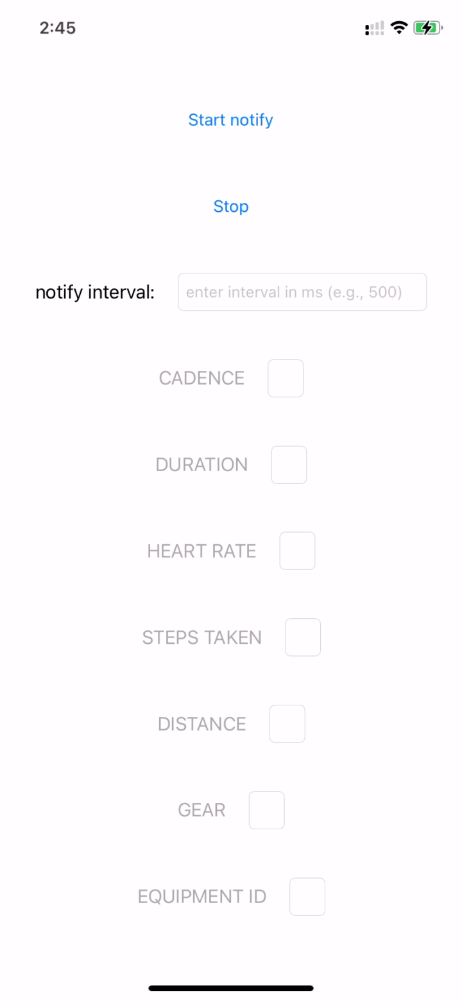

# PeripheralManager

Example of simulated BLE (Bluetooth Low Energy) device for iOS.

## Reference https://uynguyen.github.io/2018/07/23/Best-practice-How-to-deal-with-Bluetooth-Low-Energy-in-background/

## Demo
